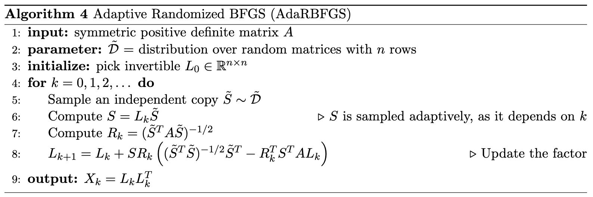
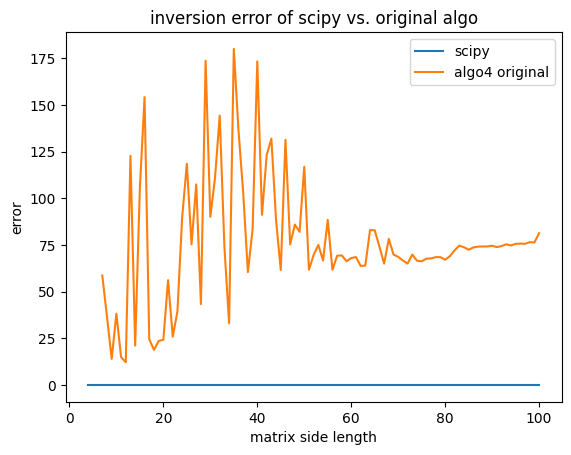
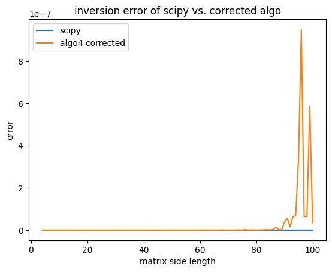
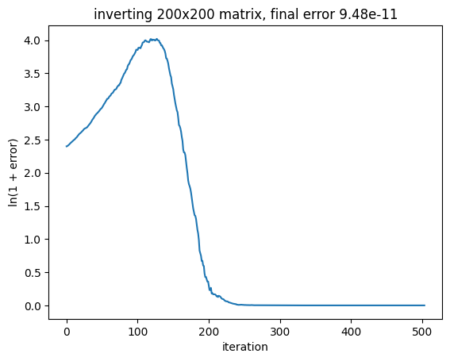

# randomised_inversion

This is a project to experiment with fast approximate randomised matrix inversion. Beyond a certain matrix size, randomised methods are the only viable approach for inversion. 

I focus on algorithms that exploit matrices that are symmetric positive definite (SPD), in order to accelerate large (kernel) linear regression, the solution to which involves inverting a $p \times p$ matrix (where $p$ is the number of features).

The ultimate aim is to beat scipy.linalg.inv on huge SPD matrices, and learn about writing performant linear algebra code in the process. 

## Project structure

Currently, the project contains the following:
1. A (corrected) implementation of algorithm 4 from [Gower and Richtarik (2016)](https://doi.org/10.1137/16M1062053), called AdaRBFGS. 
2. A jupyter notebook that includes some experiments that informed implementation choices. 

## Algorithms

### AdaRBFGS

There's some beautiful theory in the paper behind the algorithm, I'll include an exposition here/in a separate markdown file at some point.



The algorithm as presented in the paper contains a typo (all the mathematics leading up to it is correct, which helped spot the typo). Step 7 
```math
R_k = (\tilde{S}^T A \tilde{S})^{-1/2}
```
should read as 
```math
R_k = (S^T A S)^{-1/2}
```
instead. 

The difference is validated in the plots below (note the y-axes are different between the plots). Error is defined as 
```math
||A \cdot \widehat{A^{-1}} - I||_F
```
where $||\cdot||_F$ is the Frobenius norm, or the induced 2-norm.




The corrected algo was limited to 300 iterations because of the number of trials. In practice, the algorithm can achieve error $< 10^{-10}$. 



The initial increase in error (persistent across matrix size and random trials) seems to indicate that more juice can be squeezed out of the algorithm by including an appropriate stepsize schedule. However, naive attempts ($\frac{1}{\text{iteration}}$ à la Robbins-Monro) haven't worked. 

## To-do

[ ] Bracket matrix multiplication for speed-up \
[ ] Batch random matrix generation \
[ ] Flame graph for performance analysis \
[ ] Fix DRY violations \
[ ] Theoretical convergence analysis for stepsize schedule